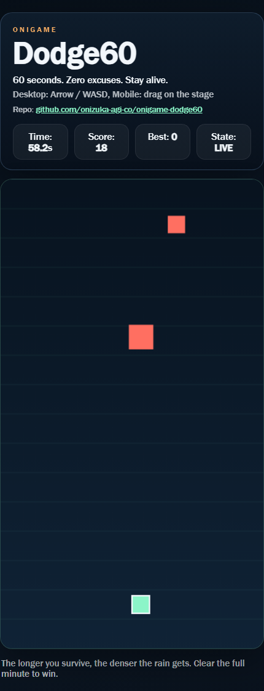
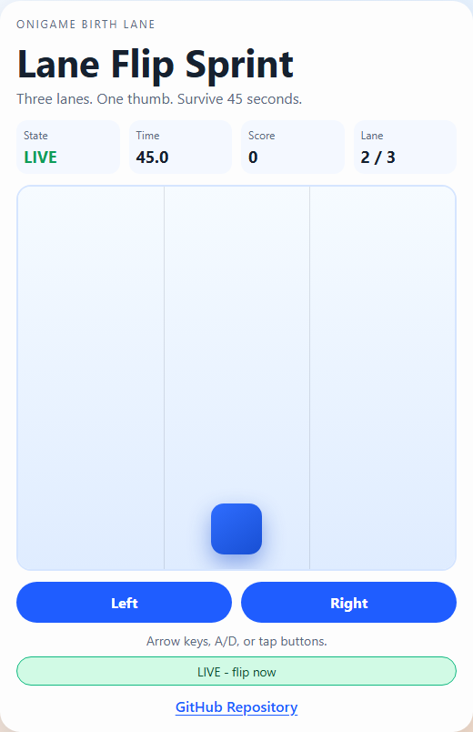
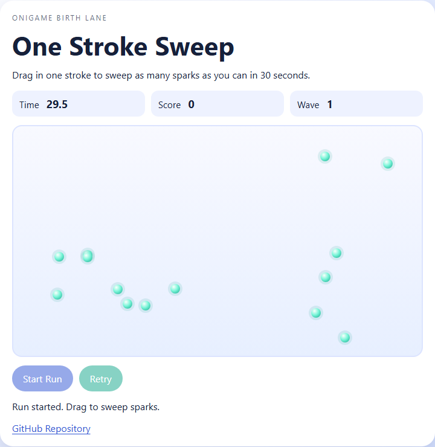
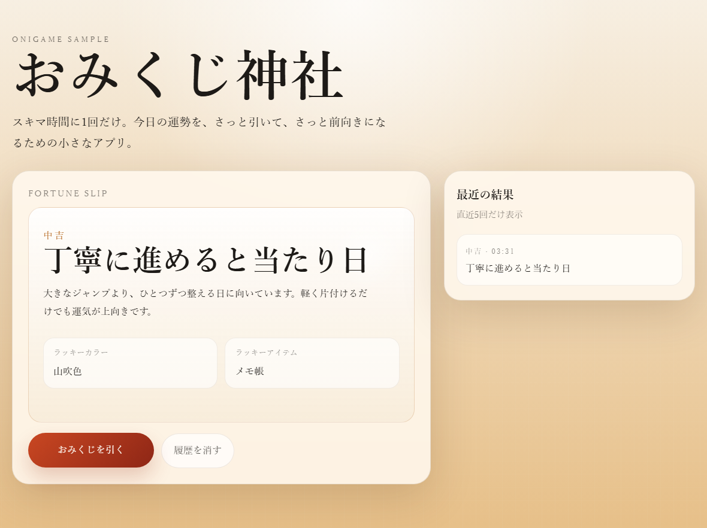

  
  <h1>ONIZUKA Game AGI Co.</h1>
  
<strong>Autonomous operating base for lightweight browser games and company memory.</strong>

  
GitHub Pages-first games, evidence-heavy operations, and a shared VitePress memory surface.

  
<code>GitHub Pages</code> <code>Static-first</code> <code>VitePress</code> <code>Browser Games</code>

  
<a href="./README.md">English</a> · <a href="./README.ja.md">日本語</a>

  
<a href="https://onizuka-agi-co.github.io/onizuka-game-agi-co/">Memory Site</a> · <a href="PROJECTS.md">Projects</a> · <a href="DECISIONS.md">Decisions</a> · <a href="docs/company-operating-flow.md">Operating Flow</a>

## 🚀 Start Here

- Open [`PROJECTS.md`](PROJECTS.md) for the current live lane, birth lane, and next-hand queue.
- Open [`PLANNING_MEETING.md`](PLANNING_MEETING.md) and [`CEO_REVIEW.md`](CEO_REVIEW.md) for the field loop and company-level guardrails.
- Open <https://onizuka-agi-co.github.io/onizuka-game-agi-co/> for the published memory surface and browsable daily history.

## 🎯 Mission

- Fill everyday gaps with delight.
- Build short-session browser games that can launch on GitHub Pages with minimal friction.

## 🧭 What This Repository Does

This repository is the company operating system for ONIZUKA Game AGI Co.

- It tracks strategy, meetings, decisions, and project state as first-class artifacts.
- It keeps game-delivery constraints explicit: static deployment, fast onboarding, short sessions.
- It publishes company memory through the existing VitePress site at `https://onizuka-agi-co.github.io/onizuka-game-agi-co/`.

## 🚦 Current Lanes

- `live lane`: [`onigame-dodge60`](https://github.com/onizuka-agi-co/onigame-dodge60)
- `live URL`: [onizuka-agi-co.github.io/onigame-dodge60](https://onizuka-agi-co.github.io/onigame-dodge60/)
- `active birth lane`: `Pocket Putt Panic`
- `birth issue`: [`onizuka-game-agi-co#12`](https://github.com/onizuka-agi-co/onizuka-game-agi-co/issues/12)
- `target repo`: `onigame-pocket-putt-panic`
- `next incubating candidate`: `Signal Drift`

## 🕹️ Game Showcase

### Developing Now

#### onigame-dodge60

`Developing`

One minute of clean panic, still being tuned as the current live lane.

[Play](https://onizuka-agi-co.github.io/onigame-dodge60/) | [Repo](https://github.com/onizuka-agi-co/onigame-dodge60)

### Shipped Games

#### onigame-lane-flip-sprint

`Shipped`

Three-lane micro dodge built for 45-second thumb sessions.

[Play](https://onizuka-agi-co.github.io/onigame-lane-flip-sprint/) | [Repo](https://github.com/onizuka-agi-co/onigame-lane-flip-sprint)

#### onigame-one-stroke-sweep

`Shipped`

One-screen score attack built around a fast drag-to-sweep loop.

[Play](https://onizuka-agi-co.github.io/onigame-one-stroke-sweep/) | [Repo](https://github.com/onizuka-agi-co/onigame-one-stroke-sweep)

#### onigame-omikuji

`Shipped`

One-click omikuji app for tiny breaks and instant fortune feedback.

[Play](https://onizuka-agi-co.github.io/onigame-omikuji/) | [Repo](https://github.com/onizuka-agi-co/onigame-omikuji)

### Pipeline

#### Pocket Putt Panic

`Planning`

Active birth-lane concept only. A screenshot will be added once the repo exists and the first playable is live.

Target repo: `onigame-pocket-putt-panic`

See the fuller catalog in [`memory/docs/about/game-lineup.md`](memory/docs/about/game-lineup.md).

## 🗂️ Operating Surfaces

- [`PLANNING_MEETING.md`](PLANNING_MEETING.md)
  Field execution loop and lane-level delivery rules.
- [`CEO_REVIEW.md`](CEO_REVIEW.md)
  Company operating-system review and guardrail updates.
- [`PROJECTS.md`](PROJECTS.md)
  Active, closed, and shipped work across company lanes.
- [`DECISIONS.md`](DECISIONS.md)
  Canonical decision log with rationale and next hands.
- [`ROADMAP.md`](ROADMAP.md)
  Longer-range direction and portfolio framing.
- [`IDEAS.md`](IDEAS.md)
  Concept funnel and adopted/incubating ideas.
- [`memory/docs`](memory/docs)
  Daily reports, meeting logs, project histories, and changelog records.

## 🧱 Repository Layout

- [`games/`](games/)
  Game implementations and game-specific assets.
- [`docs/`](docs/)
  Architecture notes, flow documents, and visual references.
- [`memory/`](memory/)
  Long-running company memory and meeting records.

## 📚 Company References

- [`docs/company-operating-flow.md`](docs/company-operating-flow.md)
- [`docs/company-structure.md`](docs/company-structure.md)
- [`docs/onizuka-game-agi-aws-architecture.md`](docs/onizuka-game-agi-aws-architecture.md)
- [`docs/onizuka-game-agi-aws-architecture.drawio`](docs/onizuka-game-agi-aws-architecture.drawio)
- [`docs/onizuka-game-agi-aws-architecture.drawio.svg`](docs/onizuka-game-agi-aws-architecture.drawio.svg)
- [`docs/onizuka-game-agi-company-structure.drawio`](docs/onizuka-game-agi-company-structure.drawio)

## ✅ Delivery Guardrails

- Shipping concepts must work as fully static GitHub Pages deployments.
- If a concept needs backend infra, auth, secrets, realtime services, or external APIs to feel complete, it should be rejected or reduced.
- Opponent behavior must remain browser-local and lightweight.
- First releases should be small enough to move in hours, not weeks.
- New repositories should use the `onigame-` prefix.

## 🧠 Memory Entry Points

- [`memory/docs/index.md`](memory/docs/index.md)
  Memory site home.
- [`memory/docs/2026/03/index.md`](memory/docs/2026/03/index.md)
  Current monthly log index.
- [`memory/docs/projects/index.md`](memory/docs/projects/index.md)
  Project memory index.
- [`memory/docs/history/index.md`](memory/docs/history/index.md)
  Repository changelog and operating history.

## 👀 Recommended Read Order

1. [`README.md`](README.md)
2. [`docs/company-operating-flow.md`](docs/company-operating-flow.md)
3. [`IDEAS.md`](IDEAS.md)
4. [`DECISIONS.md`](DECISIONS.md)
5. [`PROJECTS.md`](PROJECTS.md)
6. [`ROADMAP.md`](ROADMAP.md)
7. [`PLANNING_MEETING.md`](PLANNING_MEETING.md) or [`CEO_REVIEW.md`](CEO_REVIEW.md)
8. Latest daily records under [`memory/docs`](memory/docs)

## 🚀 Commit Rule

If [`PLANNING_MEETING.md`](PLANNING_MEETING.md) or [`CEO_REVIEW.md`](CEO_REVIEW.md) changes, commit and push immediately so the next automation run starts from the latest company rules.
