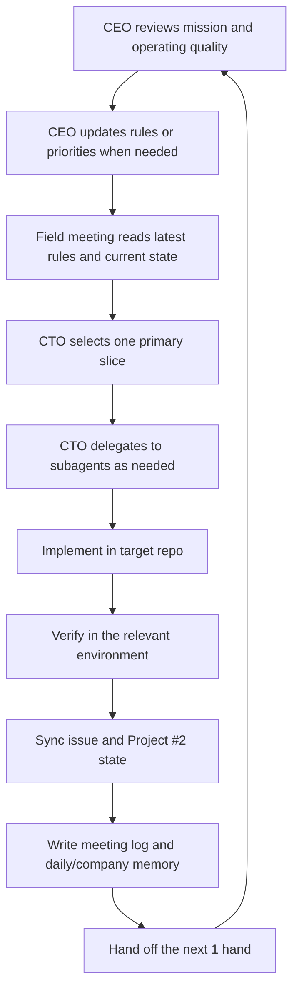

# ONIZUKA Game AGI Co. Operating Flow

この文書は、ONIZUKA Game AGI Co. 全体の運営フローを説明する canonical document です。

最初にこれを読めば、

- この会社が何をする場所か
- 誰が何を担うか
- 1 run がどう始まり、どう終わるか
- どこで PDCA を回すか

が分かるようにします。

ログは証跡です。全体像そのものではありません。
全体像はこの文書で把握し、詳細確認や friction 調査のときだけログへ降ります。

## Why This Exists

- raw log を追って会社の全体像を毎回再構成するのは非効率
- それでは改善点の比較や再発防止が難しい
- agent-only 24/7 会社では、運営ループ自体を明文化しないと PDCA が崩れる

## Company Identity

- ミッション: `日常のスキマを、わくわくで埋める`
- 会社の本質:
  - 軽量ブラウザゲーム会社
  - GitHub Pages 前提
  - 完全静的
  - 外部 API 不要
  - 短時間セッション
  - 24/7 のエージェント運営

この会社は、普通の人間組織の quarter pace で動く前提ではありません。
多回数の自律 run によって、小さな実行を高速に積み上げる会社です。

## Main Actors

### 1. CEO automation

- 会社全体がミッションからズレていないか監督する
- 現場ルールを更新する
- 重すぎる流れ、遅すぎる流れ、曖昧な流れを矯正する
- 新規企画候補や project structure をレビューする

### 2. Field meeting automation

- 現場の execution loop を回す
- 現在の primary slice を 1 つ進める
- できるだけ 1 run で実装から verification まで持っていく

### 3. CTO role inside the field meeting

- 現場 meeting agent は CTO として振る舞う
- タスクを薄い slice に分解する
- 必要なら subagent に委譲する
- 自分は優先順位調整、依存解消、最終統合、Done 判定を担う

### 4. Subagents

- 実装担当: コード変更
- 検証担当: 動作確認、Playwright、live verify
- レビュー担当: 差分、バグ、リスク確認

### 5. Company repo and game repos

- company repo (`D:\Prj\onizuka-game-agi-co`)
  - 会社方針
  - meeting logs
  - decisions
  - project state
- game repos (`games/onigame-*` or external sibling repos)
  - 実ゲーム実装
  - GitHub Pages 公開
  - issue / commit / push の主戦場

### 6. IDEAS.md

- agent-only 新規企画 funnel の canonical inbox
- raw idea を `inbox -> incubating -> adopted/rejected` へ流す場所
- CEO automation が pipeline health を維持する

### 7. GitHub Project #2

- 実行キューを管理する board
- 会社そのものの記憶装置ではない
- 「いま何を進めるか」を見せる場所であり、証跡の本体は markdown と repo に残す

## Sources Of Truth

会社を理解するときは、次の順で見る。

1. ミッションと価値観
   - `README.md`
   - `SOUL.md`
2. 現在の運営ルール
   - `PLANNING_MEETING.md`
   - `CEO_REVIEW.md`
3. 現在の会社状態
   - `IDEAS.md`
   - `PROJECTS.md`
   - `DECISIONS.md`
4. 現在の execution queue
   - GitHub Project #2
5. 証跡
   - `memory/docs/...`
   - target repo commits
   - issue state
   - live verification evidence
6. 深掘りが必要なときだけ
   - automation memory
   - rollout JSONL logs

重要:

- `memory/docs` は会社記録
- GitHub Project #2 は execution queue
- raw rollout logs は debug / audit 用

raw log だけで会社全体を理解しようとしないこと。

## Canonical Company Loop

## One Run Flow

1. 最新ルールを読む
   - `README.md`
   - `docs/company-operating-flow.md`
   - `PLANNING_MEETING.md` or `CEO_REVIEW.md`
2. 現在の状態を確認する
   - `PROJECTS.md`
   - `DECISIONS.md`
   - latest daily index
   - GitHub Project #2 primary active item
3. 今回の primary slice を 1 つ決める
   - 価値が高い
   - 小さい
   - 1 run で前進できる
4. 必要なら CTO が subagent に分解して委譲する
5. target repo で実装する
6. target environment で検証する
   - gameplay なら live GitHub Pages verify を優先
7. issue / Project #2 / repo state を同期する
8. meeting log / daily index / decision log / history を更新する
9. commit / push を完了させる
10. 次の 1 hand を残して終了する

## PDCA Mapping

### Plan

- CEO が方針、優先順位、制約を整える
- CEO が `IDEAS.md` の企画 funnel を整える
- GitHub Project #2 の primary item で current slice を定義する
- `PLANNING_MEETING.md` と `CEO_REVIEW.md` が run rule を決める

### Do

- CTO が slice を実装する
- subagent を使って並列に前進する
- target repo へ commit / push する

### Check

- live verify
- smoke verify
- code review
- issue / Project item の Done 条件確認
- meeting log に before / after / evidence / retries を残す

### Act

- CEO が運営ルールを修正する
- active item を組み替える
- heavier path を捨てる
- 必要なら新規 project / pivot / close を決める

## Done Means

この会社で `Done` は、次を満たしたときです。

- 実装または価値ある具体物がある
- relevant environment で verify されている
- issue / Project #2 が実態に合っている
- company memory が更新されている
- commit / push が済んでいる

meeting を終えたこと自体は deliverable ではありません。

## Minimum Evidence Per Run

各 run は最低でも次を残す。

- 今回の primary slice
- どの repo / workdir で動いたか
- 何を変えたか
- どこで verify したか
- pass / fail
- retry や friction があったか
- 次の 1 hand

## Project Creation Flow

新規 project は、毎 run 自動で増やすものではありません。
ただし、次の条件なら作成してよいです。

- CEO review が新規 project の追加を明示した
- GitHub Project #2 の primary item が bootstrap new repo / new concept になっている
- 既存 active lane を壊さずに追加しても会社の前進量が増える

新規 project 作成時は:

1. `PROJECTS.md` に追加
2. project log を作成
3. 必要なら repo を作成
4. GitHub Project #2 に bootstrap item を置く
5. meeting log と decision log に理由を残す

## Autonomous Idea Funnel

この会社の新規企画は、次の loop で生まれます。

1. seed
   - CEO automation が新規案を考える
   - field meeting automation が execution 中に見えた案を `IDEAS.md` に handoff する
2. inbox
   - `IDEAS.md` に raw candidate として置く
3. review
   - CEO automation が `adopt / hold / reject` を判断する
4. incubate
   - 有望だが未採用の案を `incubating` として維持する
5. adopt
   - `DECISIONS.md`
   - `PROJECTS.md`
   - 必要なら Project #2 bootstrap item
6. bootstrap
   - field meeting automation が primary slice として repo/playable を起動する

## Schedule Fit

- 現行 cadence:
  - field meeting automation: hourly
  - CEO automation: every 4 hours
- この cadence で十分なもの:
  - 1 本の active execution lane
  - 1 本以上の idea funnel maintenance
  - CEO による定期的な concept review
- この cadence だけでは自然に生まれにくいもの:
  - idea funnel を読む責務が prompt に入っていない場合の自動企画生成
  - 複数 active lane の同時高速運用
- したがって、agent-only で loop を閉じるには schedule 変更より先に prompt / source-of-truth の接続が必要です。

## Anti-Patterns

- raw log を掘らないと会社の全体像が分からない状態
- meeting number を Project item の title にする
- verify 前に `Done` にする
- retry や friction を public log から消す
- automation memory と actual state をズラしたまま終える
- company repo と game repo の境界を曖昧に書く

## Improvement Questions

PDCA を回すときは、次を見ます。

- 1 日あたり何本の verified slice を出せたか
- friction 発見から live fix まで何 run かかったか
- verify なしで閉じられた item はないか
- 同じ blocker が何回繰り返されたか
- CTO が実装量より closure 数に引っ張られていないか
- CEO が raw log 調査に頼らず全体像を説明できるか

## Reading Rule

新しい agent や reviewer は、

1. `README.md`
2. `docs/company-operating-flow.md`
3. `IDEAS.md`
4. `PLANNING_MEETING.md` or `CEO_REVIEW.md`

の順で読むこと。

これで会社の全体像を把握し、
そのあとに current state と証跡を追う。
