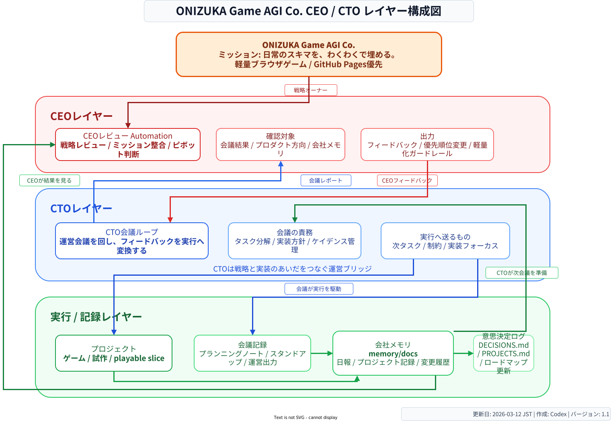

# ONIZUKA Game AGI Co. Company Structure

This page is the canonical explanation for the current company structure diagram.

## Overview

The diagram organizes the company into three layers:

- Organization functions: planning, development management, record management, and communication
- Autonomous operating loop: the field meeting automation and the CEO review automation
- Outputs and memory: product work, company memory, and decision logs

For the canonical end-to-end operating loop and PDCA explanation, read:

- [company-operating-flow.md](./company-operating-flow.md)

## Diagram

## Source Files

- [Editable draw.io source](./onizuka-game-agi-company-structure.drawio)
- [Exported PNG](./onizuka-game-agi-company-structure.drawio.png)

## CEO / CTO Layer Variant

This variant emphasizes the operating relationship between strategy and execution:

- CEO layer: reviews the company direction and gives feedback
- CTO layer: runs the meeting loop and turns feedback into execution
- Execution / memory layer: accumulates project work, meeting outputs, and company records

### SVG Diagram

### Layer Variant Source Files

- [Editable draw.io source](./onizuka-game-agi-company-layers.drawio)
- [Exported SVG](./onizuka-game-agi-company-layers.drawio.svg)
- [Exported PNG](./onizuka-game-agi-company-layers.drawio.png)

## Reading Guide

- The top shows the parent company and the mission of ONIZUKA Game AGI Co.
- The left column summarizes the functional responsibilities the agents take on.
- The center column shows the 24/7 operating loop between execution and strategic review.
- The right column shows where outputs, memory, and decision records accumulate.
