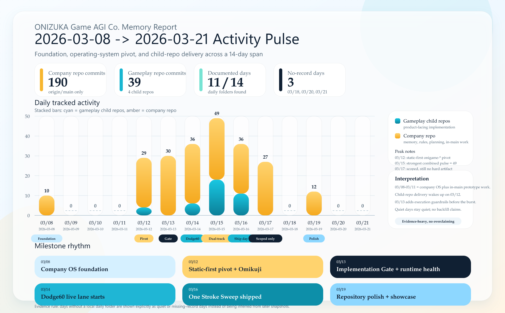

# 2026-03-21

## 今日のタスク

- [x] `2026-03-08` から `2026-03-21` までの活動報告を Memory topic として詳細化
- [x] company repo (`origin/main`) と gameplay child repos を横断して `Activity Pulse` グラフを作成
- [x] 既存 showcase asset を使って app screenshots を topic に掲載
- [x] topic / graph asset の導線を日次ページに集約
- [x] `npm run docs:build` で Memory site build を確認
- [x] `git-flow-skill` で company repo の Git Flow baseline を初期化し、`develop` を `origin/develop` まで公開、local `gitflow.*` 設定を追加

## 活動ハイライト

- `2026-03-08` は Memory / VitePress / GitHub Pages / AGENTS / meeting templates を立ち上げた foundation day
- `2026-03-09` から `2026-03-11` は `Grid Tactics` の rules / smoke / invariant を詰めた validation span
- `2026-03-12` は `Grid Tactics` を閉じ、`onigame-` 命名と static-first guardrail、`onigame-omikuji` / `onigame-quickshot` planning に切り替えた pivot day
- `2026-03-13` は Project #2 auth / PAT / push blocker への対処と `Implementation Gate` 追加が中心
- `2026-03-14` から `2026-03-16` は `onigame-dodge60` / `onigame-lane-flip-sprint` / `onigame-one-stroke-sweep` を一気に前進させた delivery burst
- `2026-03-17` は `Pocket Putt Panic` を active birth lane に選定したが、child repo / scaffold / Pages verify は未着手
- `2026-03-19` は repository polish day。`2026-03-18` は local daily record なし、`2026-03-20` と `2026-03-21` は runtime log のみ確認
- company repo は `main` only state から `main + develop` へ移行し、通常開発は `develop` 起点で進める基盤を整備

## 関連リンク

- [topic-activity-report-2026-03-08-to-2026-03-21](./topic-activity-report-2026-03-08-to-2026-03-21.md) - foundation から delivery burst、planning-only lanes、showcase screenshots まで含む詳細版
