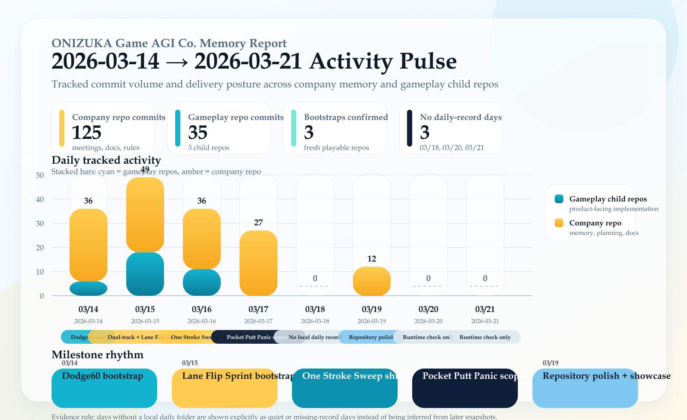

# Topic: Weekly Activity Report (2026-03-14 to 2026-03-21)

- **作成日:** 2026-03-21 JST
- **対象期間:** 2026-03-14 00:00 JST から 2026-03-21 23:59 JST
- **集計対象:** company repo (`D:\Prj\onizuka-game-agi-co`) と child gameplay repos
- **可視化:** commit volume と delivery posture をまとめた `Activity Pulse` グラフ

## エグゼクティブサマリー

この週は、前半で gameplay 実装を強く進め、中盤で新 birth lane の選定と運営ルール修正、後半で public-facing polish を集中的に行った。

`2026-03-14` から `2026-03-16` にかけては `onigame-dodge60`、`onigame-lane-flip-sprint`、`onigame-one-stroke-sweep` の3本が実際の hard artifact を積み上げた期間だった。Gameplay child repos の tracked commit は合計 `35` 件で、`onigame-dodge60 = 22`、`onigame-lane-flip-sprint = 12`、`onigame-one-stroke-sweep = 1` を確認した。

`2026-03-17` は `Pocket Putt Panic` を active birth lane に固定し、company issue `#12` を作成して concept / first playable / repo plan まで lock したが、`2026-03-21` 時点でも `games/onigame-pocket-putt-panic/` の child repo、初期 scaffold、first local commit、remote repo、GitHub Pages verify は確認できていない。したがってこの birth lane は「選定済み・仕様固定済み」だが、まだ「起動済み」ではない。

`2026-03-19` は gameplay delivery ではなく docs / brand / showcase の polish が中心だった。README 英日整備、`LICENSE` 追加、Memory brand mark の導入、game showcase screenshots、diagram readability / palette refresh を行い、対外的な見え方を一段引き上げた。

## 集計方針

- 一次ソースは日付付き daily record と `memory/docs/history/index.md`
- 二次ソースは company repo と child repos の `git log`
- `PROJECTS.md` と `DECISIONS.md` は snapshot drift を避けるため、日付付き記録と一致する部分だけ補助的に参照
- `memory/docs/2026/03/18/`, `2026/03/20/`, `2026/03/21/` が存在しない日は `no local daily record found` として扱い、後日の snapshot から逆算しない

## 週次スコアボード

| 指標 | 値 | メモ |
|------|----|------|
| company repo tracked commits | `125` | meetings, docs, history, rules, diagram, README polish を含む |
| gameplay child repo tracked commits | `35` | `onigame-dodge60`, `onigame-lane-flip-sprint`, `onigame-one-stroke-sweep` |
| 確認できた bootstrap | `3` | `onigame-dodge60`, `onigame-lane-flip-sprint`, `onigame-one-stroke-sweep` |
| public-facing polish day | `1` | `2026-03-19` |
| no local daily record found | `3` | `2026-03-18`, `2026-03-20`, `2026-03-21` |

## 日別カバレッジ

| 日付 | daily record | game repo commits | company repo commits | 区分 | 主要内容 |
|------|--------------|------------------|----------------------|------|----------|
| `2026-03-14` | あり | `6` | `30` | build + operating rules | `onigame-dodge60` bootstrap、READY/LIVE改善、operating flow / idea funnel 追加 |
| `2026-03-15` | あり | `18` | `31` | dual-track execution | `onigame-dodge60` 連続改善、`onigame-lane-flip-sprint` bootstrap + Pages公開 |
| `2026-03-16` | あり | `11` | `25` | ship + verified fixes | `onigame-one-stroke-sweep` bootstrap + Pages verify、Dodge60 / Lane Flip Sprint 継続改善 |
| `2026-03-17` | あり | `0` | `27` | planning + coordination-only + rule repair | `Pocket Putt Panic` 仕様lock、repo missing のまま hard-start rule を追加 |
| `2026-03-18` | なし | `0` | `0` | quiet | no local daily record found |
| `2026-03-19` | あり | `0` | `12` | docs / brand polish | bilingual README、Memory brand、showcase、diagram refresh |
| `2026-03-20` | なし | `0` | `0` | quiet | tracked commit なし、runtime check log のみ |
| `2026-03-21` | なし | `0` | `0` | quiet | tracked commit なし、runtime check log のみ |

## Gameplay Delivery Detail

### `onigame-dodge60`

- 期間中 tracked commit `22`
- `2026-03-14`: playable 立ち上げ、READY猶予、HUD countdown、mobile drag feel、被弾フラッシュ、in-app GitHub link
- `2026-03-15`: game-over readability、retry cue、READY入力ロック、LIVE-start cue、post-restart clarity を連続改善
- `2026-03-16`: LIVE cue最小表示時間、実移動まで cue を残す判定、READY入力ロック可視化、first spawn 遅延 `0.58 -> 0.92` まで前進
- 直近の explicit next hand は `onigame-dodge60#25`。ただし `2026-03-17` 以降は birth lane hard-start 後に再開する前提で記録されている

### `onigame-lane-flip-sprint`

- 期間中 tracked commit `12`
- `2026-03-15`: bootstrap、lane indicator、retry cue、READY入力ロック、blocked lane feedback、LIVE transition cue を実装
- `2026-03-16`: LIVE cue 持続、first hazard delay `0.35 -> 0.72`、READY queue、queued auto-apply 時の LIVE cue 即消灯抑制まで到達
- `#10` 完了後は monitor lane に近い扱いとなり、`2026-03-16` 後半以降は post-playtest friction 観測待ち

### `onigame-one-stroke-sweep`

- 期間中 tracked commit `1`
- `2026-03-16` に bootstrap。same-day で repo 作成、playable 実装、Pages verify まで完了
- この週の中では最も明確な fresh birth completion artifact

### `Pocket Putt Panic`

- `2026-03-17` に active birth lane として採用
- company issue `onizuka-game-agi-co#12` を作成し、`15-second one-screen mini-putt score attack`、`pull-and-release`、`one tiny hole + one moving blocker + retry + repo link` を lock
- ただし `2026-03-21` 時点で次の hard artifact は未達:
  - [ ] `games/onigame-pocket-putt-panic/` child repo 作成
  - [ ] `index.html` / `styles.css` / `app.js` / `README.md` の初期 scaffold
  - [ ] first local commit
  - [ ] remote repo 作成
  - [ ] `main` push
  - [ ] GitHub Pages verify
- したがって現況表現は「selected and scoped, but not launched」が正確

## Company OS / Docs / Public-Facing Progress

### `2026-03-14`

- `docs/company-operating-flow.md` を追加し、会社運営の canonical PDCA reference を明文化
- `IDEAS.md` を agent-only 新規企画 funnel として再定義
- `README.md`, `PLANNING_MEETING.md`, `CEO_REVIEW.md` を idea loop と operating flow に接続

### `2026-03-17`

- coordination-only 連続を受け、`Birth Lane Hard-Start Rule` と `Birth Repo Execution Path` を追加
- `repo missing` の birth lane を `Done` や launch 済みとして過剰主張しない境界を company OS に埋め込んだ
- この日は game repo code change は確認できず、運営ルール修正が主成果

### `2026-03-19`

- `README.md` / `README.ja.md` を public-facing landing として再構成
- `LICENSE` を追加
- `memory/docs/.vitepress/public/memory-brand.svg` を導入し、Aurora colormap へ配色を統一
- `memory/docs/about/game-lineup.md` と screenshot showcase を追加し、開発中1本 + 公開済み3本を可視化
- company structure / AWS-style diagrams の readability と palette を刷新

## Blockers And Risk Notes

- 最大の blocker は `Pocket Putt Panic` の hard artifact 不在
- `2026-03-17` の run は複数回が coordination-only で、`no game-repo code change / no live verify / no Done claim` として扱うのが正確
- `2026-03-18`, `2026-03-20`, `2026-03-21` は local daily record 不在のため、behind-the-scenes progress を推測しない

## Latest Explicit Next Hands

`2026-03-21` 時点で新しい daily operating log はないため、最新の explicit next hand は `2026-03-17` の field logs を尊重する。

- primary: `onizuka-game-agi-co#12` を実行し、`games/onigame-pocket-putt-panic/` の child repo + scaffold + first local commit を最初の hard artifact として残す
- secondary: `onigame-dodge60#25` はその hard artifact 後に `one early-run confidence fix + live verify` の verified live-lane slice として再開
- `2026-03-19` の repository polish はこの lane order を変更していない

## Evidence Snapshot

- daily records: `memory/docs/2026/03/14/index.md`, `15/index.md`, `16/index.md`, `17/index.md`, `19/index.md`
- history rollup: `memory/docs/history/index.md`
- repo activity: company repo + child repos (`games/onigame-dodge60`, `games/onigame-lane-flip-sprint`, `games/onigame-one-stroke-sweep`) の `git log`
- runtime-only check: `memory/docs/history/automation-runtime-check.log`
